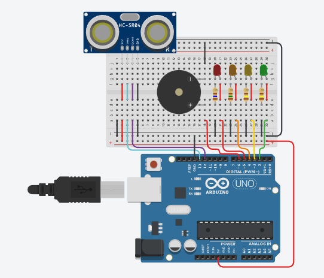
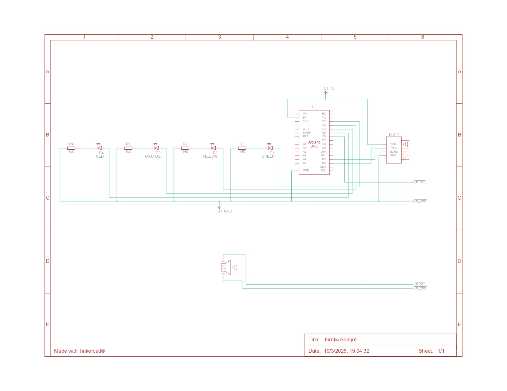

# Sensor de Proximidad

### Descripción

El sensor de proximidad es un dispositivo que permite detectar la presencia de objetos cercanos. En este caso, se utiliza un sensor ultrasónico HC-SR04 para medir la distancia entre el sensor y un objeto. El sensor emite un pulso ultrasónico y mide el tiempo que tarda en rebotar en el objeto y regresar al sensor. Con esta información, se puede calcular la distancia al objeto.

### Circuito

### Esquema

### Lista de componentes

| Cantidad | Componente                                 |
|----------|--------------------------------------------|
| 1        | Verde LED                                  |
| 1        | Amarillo LED                               |
| 1        | Naranja LED                                |
| 1        | Rojo LED                                   |
| 1        | Arduino Uno R3                             |
| 1        | 160 Ω Resistencia                          |
| 1        | 150 Ω Resistencia                          |
| 2        | 140 Ω Resistencia                          |
| 1        | Sensor de distancia ultrasónico (4 pines)  |
| 1        | Piezo                                      |