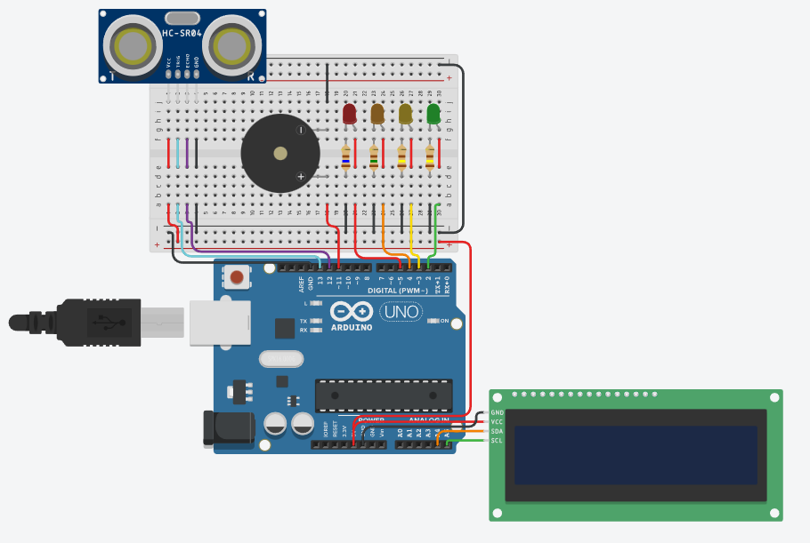
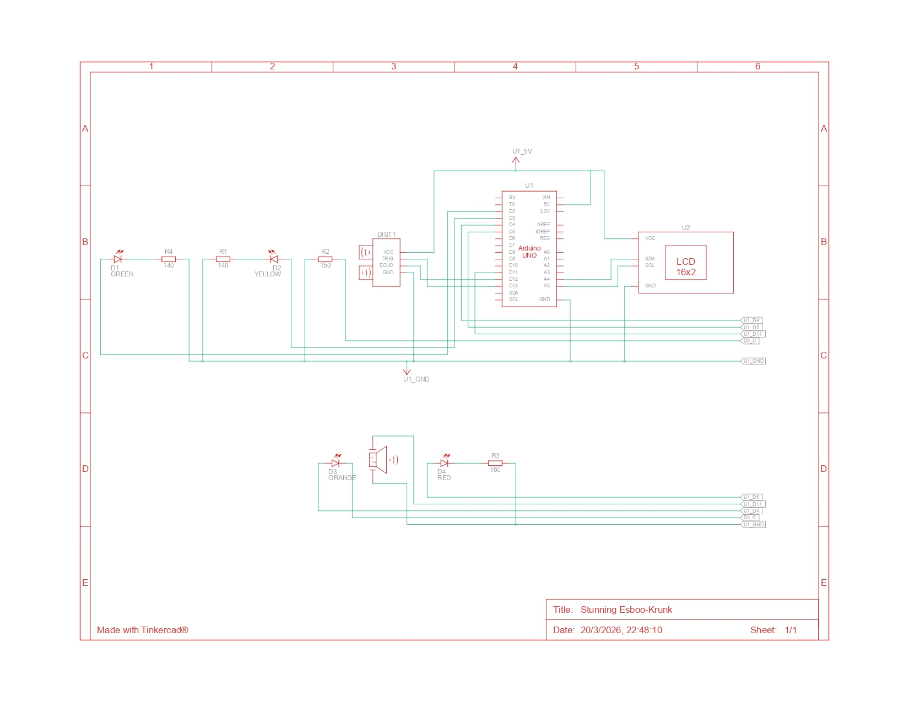

# Sensor de Nivel de Agua en un Tanque

En este proyecto se implementa un sistema de monitoreo de nivel de agua en un tanque utilizando un sensor ultrasónico HC-SR04 y una pantalla LCD I2C. Refleja el nivel de agua en porcentaje mediante leds y pantalla LCD y emite alertas sonoras cuando el nivel es crítico (Exceso o Falta de agua).

## Circuito

## Esquema

## Componentes

| Cantidad | Componente                                    |
|----------|-----------------------------------------------|
| 2        | 140 Ω Resistencia                             |
| 1        |  Arduino Uno R3                               |
| 1        |  Sensor de distancia ultrasónico (4 pines)    |
| 1        | Verde LED                                     |
| 1        | Amarillo LED                                  |
| 1        | Naranja LED                                   |
| 1        | Rojo LED                                      |
| 1        | 150 Ω Resistencia                             |
| 1        | 160 Ω Resistencia                             |
| 1        | Basado en PCF8574, 39 (0x27) LCD 16 x 2 (I2C) |
| 1        |  Piezo                                        |

## Integrantes

- Jenderson Abarca
- Reimil Azuaje