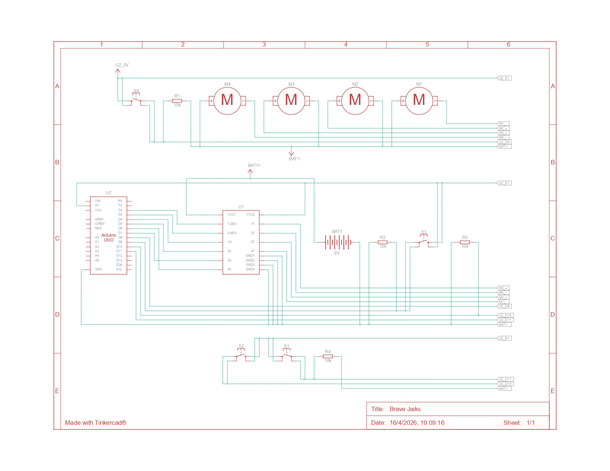
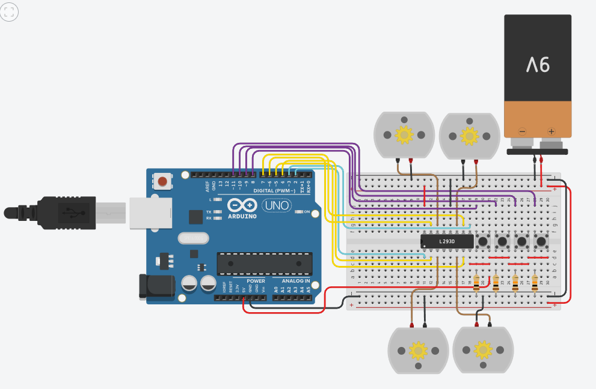

# Control Unidireccional de 4 Motores DC

## 1. Descripción General del Proyecto
Este proyecto consiste en un sistema de control para cuatro motores de corriente continua (DC) de forma independiente y unidireccional (en un solo sentido). Utiliza una placa Arduino Uno para leer el estado de cuatro pulsadores (botones) y, en función de cuál sea presionado, envía una señal a través de un circuito integrado L293D (Doble Puente H) para encender el motor correspondiente. El circuito separa lógicamente la alimentación de control (5V del Arduino) de la alimentación de potencia de los motores (Batería de 9V) para proteger el microcontrolador.

---

## 2. Funcionamiento lógico del Doble Puente H (L293D)

El circuito integrado L293D es conocido como un "Puente H", diseñado típicamente para controlar el sentido de giro de dos motores DC de forma bidireccional. Sin embargo, **en esta implementación específica, se utiliza como cuatro "Medio Puentes" independientes**. 

Dado que un terminal de cada motor está conectado directamente a tierra (GND), no se requiere invertir la polaridad para cambiar el giro. El L293D actúa aquí como un interruptor de potencia (driver): recibe una señal de bajo voltaje/corriente del Arduino y permite el paso del alto voltaje/corriente (9V) de la batería hacia el motor.

### Función de cada terminal en esta implementación:

* **Pines de Habilitación (Enable, color celeste):**
    * **Pin 1 (1,2 EN):** Conectado al pin 2 del Arduino (`master12`). Se mantiene siempre en estado `HIGH` mediante el código para habilitar los motores 1 y 2.
    * **Pin 9 (3,4 EN):** Conectado al pin 3 del Arduino (`master34`). Se mantiene siempre en estado `HIGH` para habilitar los motores 3 y 4.
* **Pines de Alimentación y Tierra (color rojo y negro):**
    * **Pin 16 (VCC1):** Alimentación de potencia. Conectado a los 5V del Arduino.
    * **Pin 8 (VCC2):** Alimentación lógica. Conectado al positivo de la batería de 9V. Esta es la energía que realmente moverá los motores.
    * **Pines 4, 5, 12, 13 (GND):** Están internamente conectados y a la vez conectados al riel de tierra común (GND de la batería y del Arduino).
    * **NOTA:** En el simulador Tinkercad, los pines 1 y 16 están invertidos.
* **Pines de Entrada (Control desde el Arduino, color amarillo):**
    * **Pin 2 (1A):** Recibe la señal del pin 4 del Arduino (`motor1`).
    * **Pin 7 (2A):** Recibe la señal del pin 5 del Arduino (`motor2`).
    * **Pin 10 (3A):** Recibe la señal del pin 7 del Arduino (`motor3`).
    * **Pin 15 (4A):** Recibe la señal del pin 6 del Arduino (`motor4`).
* **Pines de Salida (Hacia los Motores, color marrón):**
    * **Pin 3 (1Y):** Entrega 9V al Motor 1 (Superior izquierdo) cuando el pin 2 (1A) está en `HIGH`.
    * **Pin 6 (2Y):** Entrega 9V al Motor 2 (Inferior izquierdo) cuando el pin 7 (2A) está en `HIGH`.
    * **Pin 11 (3Y):** Entrega 9V al Motor 3 (Superior derecho) cuando el pin 10 (3A) está en `HIGH`.
    * **Pin 14 (4Y):** Entrega 9V al Motor 4 (Inferior derecho) cuando el pin 15 (4A) está en `HIGH`.

---

## 3. Especificación de los Cables

El cableado del diagrama está organizado por colores para facilitar su comprensión e identificación:

* **Rojo:** Representa voltaje de alimentación positivo (VCC). 
    * Conecta los 5V del Arduino al riel de alimentación inferior de la protoboard.
    * Conecta el positivo de la batería de 9V al riel de alimentación superior.
    * Lleva 5V a un extremo de cada pulsador.
* **Negro:** Representa la conexión a Tierra (GND). 
    * Unifica la tierra del Arduino y la tierra de la batería de 9V (crucial para que el circuito funcione).
    * Conecta el polo negativo de cada motor a tierra.
    * Conecta las resistencias de los botones a tierra.
* **Amarillo:** Líneas de control de salida (Outputs para el arduino, input para el L293D). Llevan las señales digitales desde los pines 2 al 7 del Arduino hacia los pines de entrada y habilitación del chip L293D.
* **Morado:** Líneas de lectura de entrada (Inputs para el arduino, outputs para los botones). Llevan la señal del estado de los botones hacia los pines digitales 8, 9, 10 y 11 del Arduino.
* **Marrón:** Líneas de potencia (Outputs para el L293D, inputs para los motores). Conectan los pines de salida del L293D (1Y, 2Y, 3Y, 4Y) al terminal positivo de sus respectivos motores. Transportan los 9V cuando se activan.

---

## 4. Explicación de los Botones y sus Resistencias

Los cuatro pulsadores están configurados utilizando un arreglo de **resistencias Pull-Down** (resistencias conectadas a tierra).

### ¿Por qué se necesitan estas resistencias?
Los pines digitales del Arduino son extremadamente sensibles. Si un botón se conecta directamente a un pin sin nada más, cuando el botón no está presionado, el pin queda "flotando" en el aire (estado de alta impedancia). En este estado, puede captar ruido electromagnético del ambiente y leer lecturas falsas de `HIGH` o `LOW` de forma errática.

### ¿Cómo funcionan en este circuito?
1.  **Estado de reposo (Botón sin presionar):** El circuito eléctrico entre los 5V y el pin digital está abierto. La resistencia conecta el pin digital del Arduino directamente a Tierra (GND). Por lo tanto, el Arduino lee un `LOW` seguro y estable (0V).
2.  **Estado activo (Botón presionado):** El botón cierra el circuito, conectando los 5V directamente al pin digital del Arduino. Como la corriente sigue el camino de menor resistencia, el voltaje de 5V inunda el pin (el Arduino lee `HIGH`), mientras que una pequeña y segura cantidad de corriente se disipa hacia tierra a través de la resistencia, evitando un cortocircuito.

---

## 5. Explicación del Código

El programa opera mediante una lógica de escaneo continuo (en la función `loop`):

1.  **Configuración Inicial (`setup`):** Se declaran los pines 2-7 como salidas (para controlar el L293D) y los pines 8-11 como entradas (para leer los botones). Inmediatamente, se envían señales `HIGH` a los pines `master12` y `master34` para despertar (habilitar) el puente H.
2.  **Reinicio constante (`disableAll`):** Al inicio de cada ciclo del bucle, todos los motores se apagan de forma predeterminada mediante la función `disableAll()`.
3.  **Evaluación Condicional:** A continuación, se utilizan condicionales `if` secuenciales. Si la lectura de un botón (`digitalRead`) es `HIGH`, el Arduino envía un `HIGH` al pin del motor correspondiente (ej. `digitalWrite(motor1, HIGH)`). 
4.  Debido a la velocidad del ciclo (y el breve `delay(10)`), el efecto visual y mecánico es inmediato: el motor solo gira mientras el usuario mantenga el botón presionado, y se apaga en el momento en que se suelta (gracias a la función `disableAll`).

## Componentes

| Cantidad | Componente                                 |
|----------|--------------------------------------------|
| 1        | Arduino Uno R3                             |
| 1        | Integrado L293D                            |
| 4        | Motor DC                                   |
| 4        | Pulsador                                   |
| 4        | 10 kΩ Resistencia                          |
| 1        | Batería de 9V                              |

## Esquema

## Circuito

## Integrantes

- Jenderson Abarca
- Reimil Azuaje